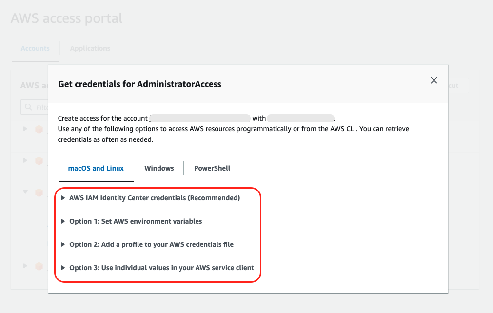
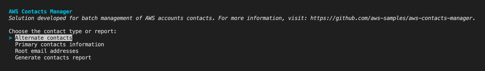
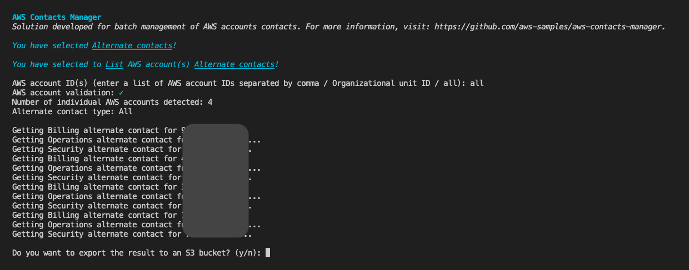
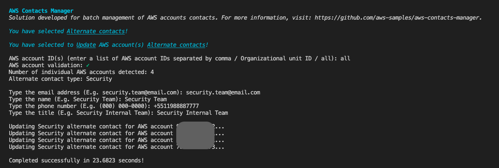
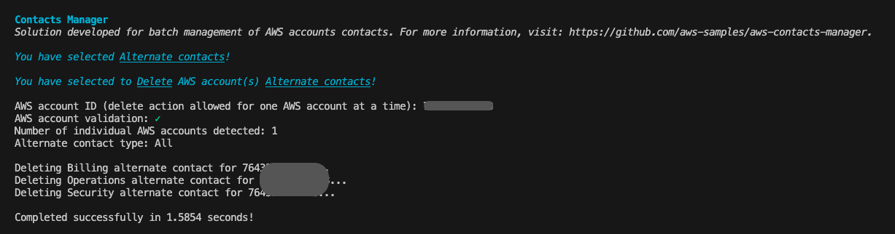
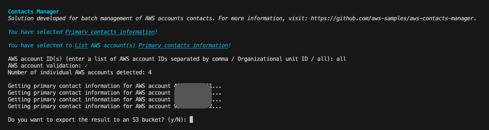
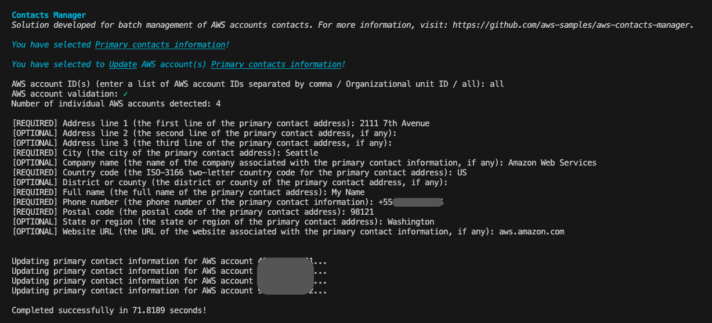
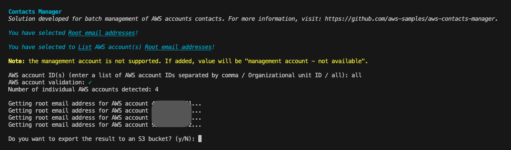
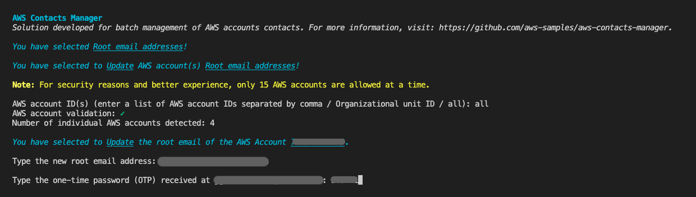
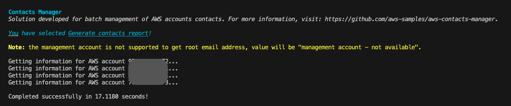

# AWS Contacts Manager

Programmatically manage AWS contacts at the AWS Organizations level - automate bulk updates for alternate contacts, primary contacts, and root email addresses across all your accounts.

---

## 🚀 What's New

**Automated Alternate Contacts Update** - Deploy `cfn.yml` to automatically synchronize alternate contacts across all Organization accounts on a schedule (default: every 7 days). [Jump to setup →](#automated-solution)

---

## Overview

This solution provides two approaches for managing AWS account contacts at scale:

1. **Interactive Script** (`script.py`) - Manual, on-demand contact management with full control
2. **CloudFormation Automation** (`cfn.yml`) - Scheduled, hands-off alternate contacts synchronization

### Why Use This Solution?

Managing contacts across multiple AWS accounts is critical for:
- **Compliance** - Ensure AWS notifications reach the right teams
- **Security** - Maintain up-to-date security contact information
- **Operations** - Keep billing and operations contacts current
- **Governance** - Enforce organizational contact standards

### Contact Types Supported

| Contact Type | Description | Script Support | Automation Support |
|--------------|-------------|----------------|-------------------|
| **Alternate Contacts** | Operations, Billing, Security contacts | ✅ List, Update, Delete | ✅ Scheduled Updates |
| **Primary Contacts** | Main account contact information | ✅ List, Update | ❌ |
| **Root Email** | Account root user email address | ✅ List, Update | ❌ |

---

## Table of Contents

- [Prerequisites](#prerequisites)
- [Interactive Script Usage](#interactive-script-usage)
  - [Setup](#setup)
  - [Running the Script](#running-the-script)
  - [Features](#features)
- [Automated Solution](#automated-solution)
  - [Architecture](#architecture)
  - [Deployment](#deployment)
  - [Benefits](#benefits)
- [Choosing the Right Approach](#choosing-the-right-approach)
- [Feedback](#feedback)

---

## Prerequisites

Before using either solution, ensure you have:

1. **AWS Organizations with All Features Enabled**
   - Required for centralized contact management
   - Default when creating a new organization
   - [Enable all features →](https://docs.aws.amazon.com/organizations/latest/userguide/orgs_manage_org_support-all-features.html)

2. **Trusted Access for AWS Account Management**
   - Allows management account to update member account contacts
   - [Enable trusted access →](https://docs.aws.amazon.com/accounts/latest/reference/using-orgs-trusted-access.html)

3. **IAM Permissions**
   - Required permissions documented in [`iam-policy.json`](iam-policy.json)
   - Must be run from management account or delegated administrator

---

## Interactive Script Usage

### Setup

Choose your preferred environment:

<details>
<summary><b>Option 1: AWS CloudShell</b> (Quick start, no local setup)</summary>

1. Sign in to your AWS management account
2. Open CloudShell from the AWS Console

   

3. Clone and setup:
   ```bash
   git clone https://github.com/aws-samples/contacts-manager.git
   cd contacts-manager
   python3 -m venv .venv
   source .venv/bin/activate
   pip install -r requirements.txt
   ```

</details>

<details>
<summary><b>Option 2: Local Terminal</b> (Recommended for report generation)</summary>

**Requirements:**
- AWS CLI ([latest version](https://raw.githubusercontent.com/aws/aws-cli/v2/CHANGELOG.rst))
- Python 3.x

**Verify installations:**
```bash
aws --version
python3 -V
```

**Setup:**
```bash
git clone https://github.com/aws-samples/contacts-manager.git
cd contacts-manager
python3 -m venv .venv
source .venv/bin/activate
pip install -r requirements.txt
```

**Authenticate:**
```bash
# Using AWS Identity Center (recommended)
aws sso login --profile your-profile

# Verify credentials
aws sts get-caller-identity
```



</details>

### Running the Script

```bash
python3 script.py
```

The script presents an interactive menu:



### Features

<details>
<summary><b>1. Alternate Contacts</b> - Manage Operations, Billing, and Security contacts</summary>

**Actions:** List, Update, Delete

**Scope Options:**
- `all` - All Organization accounts
- `123456789012,234567890123` - Specific account IDs (comma-separated)
- `ou-xxxx-xxxxxxxx` - All accounts in an OU
- `123456789012` - Single account (Delete only)

**Contact Types:**
- Operations
- Billing  
- Security

#### List Contacts
- Export to S3 bucket or display in terminal
- 

#### Update Contacts
- Provide: Name, Title, Email, Phone (international format: +1234567890)
- 

#### Delete Contacts
- Security restriction: One account at a time
- 

</details>

<details>
<summary><b>2. Primary Contacts</b> - Manage main account contact information</summary>

**Actions:** List, Update

**Scope Options:** Same as Alternate Contacts

#### List Primary Contacts
- Export to S3 or display in terminal
- 

#### Update Primary Contacts
- Provide all required contact fields
- 

</details>

<details>
<summary><b>3. Root Email Addresses</b> - Update account root user emails</summary>

**Actions:** List, Update

**Scope Options:** Same as Alternate Contacts

#### List Root Emails
- Export to S3 or display in terminal
- 

#### Update Root Emails
- Requires OTP (One-Time Password) for each account
- Status indicators: ⟳ (pending) → ✔ (done)
- 
- 

</details>

<details>
<summary><b>4. Generate Contacts Report</b> - Export all contacts to Excel</summary>

- Generates comprehensive report with all contact types
- Exports to Excel format
- **Performance:** ~4 seconds per account



</details>

---

## Automated Solution

For organizations requiring consistent alternate contacts across all accounts without manual intervention.

### Architecture

The CloudFormation template (`cfn.yml`) deploys a serverless automation solution:

```
┌────────────────────────────────────────────────────────────────────────┐
│                        CloudFormation Stack                            │
│                                                                        │
│  ┌──────────────────┐         ┌─────────────────────────────────────┐  │
│  │   EventBridge    │         │         Lambda Function             │  │
│  │    Scheduler     │────────▶│   Update Contacts (Python 3.12)     │  │
│  │  (rate: 7 days)  │         │                                     │  │
│  └──────────────────┘         │  • List all Organization accounts   │  │
│                               │  • Update alternate contacts        │  │
│  ┌──────────────────┐         │  • Handle errors gracefully         │  │
│  │    IAM Role      │────────▶│                                     │  │
│  │  (Permissions)   │         └──────────────┬──────────────────────┘  │
│  └──────────────────┘                        │                         │
│                                              │                         │
│  ┌──────────────────┐                        │                         │
│  │  CloudWatch Logs │◀───────────────────────┘                         │
│  │  (30-day retain) │                                                  │
│  └──────────────────┘                                                  │
└──────────────────────────────────────┬─────────────────────────────────┘
                                       │
                                       ▼
                        ┌──────────────────────────┐
                        │   AWS Organizations API   │
                        └──────────────┬────────────┘
                                       │
                ┌──────────────────────┼──────────────────────┐
                ▼                      ▼                      ▼
        ┌──────────────┐      ┌──────────────┐      ┌──────────────┐
        │  Account 1   │      │  Account 2   │      │  Account N   │
        │              │      │              │      │              │
        │ ✓ Operations │      │ ✓ Operations │      │ ✓ Operations │
        │ ✓ Billing    │      │ ✓ Billing    │      │ ✓ Billing    │
        │ ✓ Security   │      │ ✓ Security   │      │ ✓ Security   │
        └──────────────┘      └──────────────┘      └──────────────┘
```

**Components:**

| Component | Purpose |
|-----------|---------|
| **Lambda Function** | Python 3.12 function that updates

### Deployment

1. **Navigate to CloudFormation** in your AWS management account

2. **Create Stack** with `cfn.yml`

3. **Configure Parameters:**

   | Parameter | Description | Example |
   |-----------|-------------|---------|
   | Operations Name/Title/Email/Phone | Operations team contact | `ops@example.com` |
   | Billing Name/Title/Email/Phone | Billing team contact | `billing@example.com` |
   | Security Name/Title/Email/Phone | Security team contact | `security@example.com` |
   | Schedule Expression | Execution frequency | `rate(7 days)` or `cron(0 12 * * ? *)` |

4. **Deploy** and monitor in CloudWatch Logs

### Benefits

- ✅ **Consistency** - All accounts maintain identical contact information
- ✅ **Compliance** - Automated enforcement of contact standards
- ✅ **Zero Maintenance** - No manual intervention after deployment
- ✅ **Audit Trail** - Complete execution history in CloudWatch
- ✅ **Flexibility** - Update contacts by modifying stack parameters
- ✅ **Error Handling** - Graceful failure handling with detailed summaries

---

## Choosing the Right Approach

### Use the Interactive Script (`script.py`) when:
- ✅ Performing one-time bulk updates
- ✅ Managing primary contacts or root email addresses
- ✅ Generating comprehensive contact reports
- ✅ Testing contact changes before automation
- ✅ Need ad-hoc operations with full control

### Use the CloudFormation Automation (`cfn.yml`) when:
- ✅ Enforcing consistent alternate contacts organization-wide
- ✅ Need hands-off recurring synchronization
- ✅ Want to ensure new accounts automatically receive correct contacts
- ✅ Require audit trail and compliance documentation
- ✅ Prefer infrastructure-as-code approach

**Pro Tip:** Use both! Deploy automation for alternate contacts, and use the script for primary contacts, root emails, and reporting.

---

## Cleanup

To remove the interactive script:
```bash
cd ..
rm -rf contacts-manager
```

To remove the CloudFormation automation:
```bash
aws cloudformation delete-stack --stack-name <your-stack-name>
```

---

## Feedback

We value your input! Share your experience, suggestions, or feature requests:

📋 [Feedback Survey](https://pulse.aws/survey/LLA8GORD)

---

## Related AWS Announcements

This solution leverages these AWS features:
- [Centrally manage member account root email addresses](https://aws.amazon.com/about-aws/whats-new/2024/06/manage-member-account-root-email-addresses-aws-organization/) (Jun 2024)
- [Centrally manage primary contact information](https://aws.amazon.com/about-aws/whats-new/2022/10/aws-organizations-console-centrally-manage-primary-contact-information-aws-accounts/) (Oct 2022)
- [Centrally manage alternate contacts](https://aws.amazon.com/about-aws/whats-new/2022/02/aws-organizations-console-manage-alternate-contacts/) (Feb 2022)

---

## Security

See [CONTRIBUTING](CONTRIBUTING.md#security-issue-notifications) for security issue notifications.

## License

This library is licensed under the MIT-0 License. See the [LICENSE](LICENSE) file.
