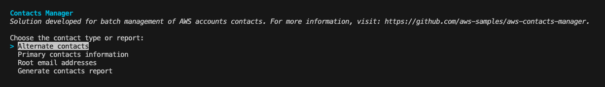

# Contacts Manager

### Programmatically manage AWS contacts at the AWS Organizations level

In this repository, we share code for batch management of contacts from your AWS accounts in an [AWS Organizations](https://aws.amazon.com/organizations/).

This solution was developed thanks to these announcements:
- _Posted on: Jun 07, 2024_ - [Centrally manage member account root email addresses across your AWS Organization](https://aws.amazon.com/about-aws/whats-new/2024/06/manage-member-account-root-email-addresses-aws-organization/)
- _Posted on: Oct 25, 2022_ - [AWS Organizations console now allows users to centrally manage primary contact information on AWS accounts](https://aws.amazon.com/about-aws/whats-new/2022/10/aws-organizations-console-centrally-manage-primary-contact-information-aws-accounts/)
- _Posted on: Feb 09, 2022_ - [AWS Organizations console now lets users centrally manage alternate contacts on AWS accounts](https://aws.amazon.com/about-aws/whats-new/2022/02/aws-organizations-console-manage-alternate-contacts/)

## Prerequisites

- Your organization must enable all features to manage settings on your member accounts. This allows admin control over the member accounts. This is set by default when you create your organization. If your organization is set to consolidated billing only, and you want to enable all features, see [Enabling all features in your organization](https://docs.aws.amazon.com/organizations/latest/userguide/orgs_manage_org_support-all-features.html).
- You need to enable trusted access for AWS Account Management service. To set this up, see [Enabling trusted access for AWS Account Management](https://docs.aws.amazon.com/accounts/latest/reference/using-orgs-trusted-access.html).
- You need the necessary IAM permissions to run the tool. Please, refer to [IAM Policy file](iam-policy.json).

## Usage

> **⚠️ Note:** Make sure you will sign-in at the management account of the AWS Organizations or the delegated administrator member account for AWS Organizations.

1. Choose where you want to run it (CloudShell or Local terminal):
    - 

CloudShell
 

        1. Sign-in to you AWS account.
        2. Open CloudShell.

            

        3. When CloudShell opens, you will run the following command:
            1. Clone the repository.

                   git clone https://github.com/aws-samples/contacts-manager.git

            2. Make a clean install.

                   python3 -m venv .venv
                   source .venv/bin/activate

            3. Install dependencies.

                   cd contacts-manager
                   sh -e requirements.txt

    

    - 

Local terminal (recommended if you will run the Generate contacts report)
 

        1. Open you local terminal.
        2. Make sure to have AWS CLI and Python3 installed.
            -  Checking AWS CLI version ([latest version](https://raw.githubusercontent.com/aws/aws-cli/v2/CHANGELOG.rst)).

                   aws --version

            - Checking Python version

                  python -V

                or

                  python3 -V

        3. Sign-in to you AWS account in the local terminal.
            - We recommed to use the credentials from AWS Identity Center (SSO).

                

            - You can run the following command to check your credentials.

                  aws sts get-caller-identity

        4. Clone the repository.

               git clone https://github.com/aws-samples/contacts-manager.git

        5. Make a clean install.

               python3 -m venv .venv
               source .venv/bin/activate

        6. Install dependencies.

               cd <aws-contacts-manager-folder>
               sh prereq.sh
    

2. Run the script.

       python3 script.py

3. The first step is to choose which contact options you want to interact.

    

- 

Alternate contacts
 

    1. When selected, choose one of the 3 action options.

        

    2. Input a list of AWS account IDs separated by comma, the Organization unit ID or all. For the Delete action, for security reasons, it is only allowed to run one AWS account ID at a time. Below are some input examples:

        - all
        - 000000000000,111111111111,222222222222,333333333333
        - 000000000000, 111111111111, 222222222222, 333333333333
        - ou-a0aa-abcdef0g
        - 012345678910 _(valid for Delete action)_

    3. Choose which type of alternate contact.

        

    - List action

        1. For List action, there is the option to export the result to an s3 bucket.

            

        2. Inputting "y" will ask for the name of an S3 bucket to upload. Inputting "n", the result will return on the CloudShell or local terminal screen.

            

    - Update action

        1. For Update action, it will be required to fill in all the contact fields, you must pay attention to the right pattern. Below are some input examples:

            - Email: example@mail.com
            - Name: My Name
            - Phone number: +5511900002222
            - Title: Technical Account Manager

                

    - Delete action

        1. For the Delete action, for security reasons, it is only allowed to run one AWS account ID at a time.

            

- 

Primary contacts information
 

    1. When selected, choose one of the 2 action options

        

    2. Input a list of AWS account IDs separated by comma, the Organization unit ID or all. For the Delete action, for security reasons, it is only allowed to run one AWS account ID at a time. Below are some input examples:

        - all
        - 000000000000,111111111111,222222222222,333333333333
        - 000000000000, 111111111111, 222222222222, 333333333333
        - ou-a0aa-abcdef0g
        - 012345678910 _(valid for Delete action)_

    - List action

        1. For List action, there is the option to export the result to an s3 bucket.

            

        2. Inputting "y" will ask for the name of an S3 bucket to upload. Inputting "n", the result will return on the CloudShell or local terminal screen.

            

    - Update action

        1. For Update action, it will be required to fill in all the contact fields, you must pay attention to the right pattern.

            

- 

Root email addresses
 

    1. When selected, choose one of the 2 action options

        

    2. Input a list of AWS account IDs separated by comma, the Organization unit ID or all. For the Delete action, for security reasons, it is only allowed to run one AWS account ID at a time. Below are some input examples:

        - all
        - 000000000000,111111111111,222222222222,333333333333
        - 000000000000, 111111111111, 222222222222, 333333333333
        - ou-a0aa-abcdef0g
        - 012345678910 _(valid for Delete action)_

    - List action

        1. For List action, there is the option to export the result to an s3 bucket.

            

        2. Inputting "y" will ask for the name of an S3 bucket to upload. Inputting "n", the result will return on the CloudShell or local terminal screen.

            

    - Update action

        1. For Update action, it will be required to fill in all the contact fields. A status prefix of "⟳" (pending) and "✔" (done) will be shown to monitor the status of AWS account changes.

            

        2. When you select an account, you must add the OTP (One-Time Password). This must be done one account at a time.

            

        3. Once you update the root email address, the status will be changed to "✔" (done). When all statuses are “checked”, the function will be completed.
     
            

- 

Generate contacts report
 

    - When selected, the tool will generate a report with all contacts from all Organizations accounts.  
    **Note:** it will take an averge of 4s per account.

        

4. _[Optional]_ Remove the tool.

       cd ..
       rm aws-contacts-manager

## Feedback

Feedback is always welcome! Please, share you experience, thoughts, feature request: [Feedback Survey](https://pulse.aws/survey/LLA8GORD).

## Security

See [CONTRIBUTING](CONTRIBUTING.md#security-issue-notifications) for more information.

## License

This library is licensed under the MIT-0 License. See the LICENSE file.

